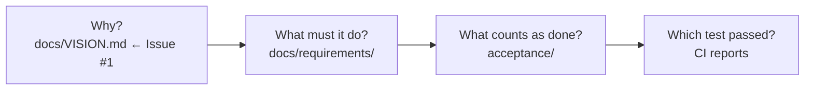

# Documentation map

Audience: a human or an agent who has just opened `docs/` and needs to know
which layer answers which question.

This file is a map. It owns no product fact. Each layer has its own owner;
where this map and an owner disagree, the owner is right.

## Which question lives where

| Question | Layer | Owner today |
| --- | --- | --- |
| Why does this atelier exist? | Vision | [`VISION.md`](VISION.md). Desk/Doku reading of [Issue #1](https://github.com/FlexOr2/atelier-2/issues/1); the issue wins. Copying Issue #1 into this tree is forbidden. |
| What does the house look like? | Face | [`atelier.jpg`](atelier.jpg). One picture, one owner. The README embeds it so GitHub shows the door. Not a second logo farm. |
| What must it be able to do? | Requirements | Numbered documents indexed by [requirements/README.md](requirements/README.md). Views of issue threads; the thread wins. |
| How is it used? | Journeys | [`journeys/`](journeys/). They illustrate requirements and bind nothing. Each journey names the REQ ids it walks. |
| What does the machine count as done? | Acceptance | `acceptance/*.toml` at the repository root, with schema and trace rules in [requirements/README.md](requirements/README.md). |
| Why was it built this way? | Decisions | Records indexed by [decisions/README.md](decisions/README.md). |
| What exists today? | Product | [PRODUCT.md](PRODUCT.md). Implementation status. |
| How is this installation started? | Operations | [OPERATIONS.md](OPERATIONS.md). The operator runbook for the packaged serve. |
| How is an executor toolchain pinned? | Operations | [OPERATIONS.md](OPERATIONS.md). An atelier-owned copy; not the operator's daily `~/.local/bin` CLI. |

Agent policy lives in [`AGENTS.md`](../AGENTS.md) at the repository root, not here.

## The audit chain

An auditor should be able to walk **vision → requirement sentence → acceptance
sentence → passing test** in both directions. Today the last hop is
machine-checked ([ADR 0012](decisions/0012-acceptance-trace-format.md)). The
first hops are hand-maintained views. A requirement sentence that names no
acceptance identifier says `UNGEBUNDEN` instead of pretending.

*Question this diagram answers: which way does the audit chain run? Source:
Issue #163 body and the owners in the table above. Journeys hang off the
requirement layer and do not sit on the chain: they illustrate, they do not
bind.*

## What this map does not do

It does not list every file. It does not restate [PRODUCT.md](PRODUCT.md) or
any requirement. It does not treat a planned layer as present.
