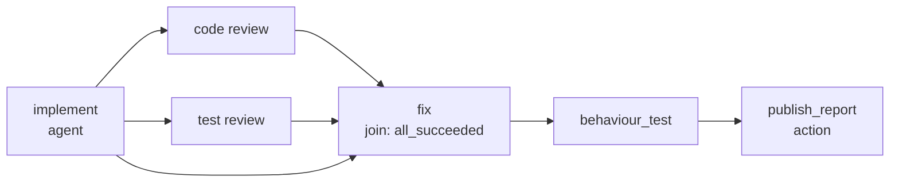

# ADR 0006: Format V3 is the whole authoring language; capabilities stage execution

- Status: DRAFT — proposed for review, not accepted, not implemented
- Date: 2026-08-14
- Depends on: [ADR 0002](0002-exact-yaml-graph.md), [ADR 0001](0001-durable-runtime.md)
- Requirement authority: [Issue #1](https://github.com/FlexOr2/atelier-2/issues/1),
  whose "Deklaratives Kontext- und Artefaktrouting", "Parallele DAG-Ausführung"
  and "Operator besitzt den Workflow" sections this record expresses and never
  re-decides
- Feeds: [#6](https://github.com/FlexOr2/atelier-2/issues/6) (catalog),
  [#7](https://github.com/FlexOr2/atelier-2/issues/7) (Dirigent)
- Names, never decides, the dependencies owned elsewhere:
  [#22](https://github.com/FlexOr2/atelier-2/issues/22) (catalog identity),
  [#24](https://github.com/FlexOr2/atelier-2/issues/24) (platform adapter),
  [#25](https://github.com/FlexOr2/atelier-2/issues/25) (bounded iteration),
  [#26](https://github.com/FlexOr2/atelier-2/issues/26) (budget),
  [#9](https://github.com/FlexOr2/atelier-2/issues/9) (interactive attach),
  #1 story 5 (context resolver)

Two version numbers meet here. **V1** is the product release Issue #1 decides.
**Format version 3** is the workflow document contract this record proposes, the
third after the V1 and V2 of [ADR 0002](0002-exact-yaml-graph.md). V3 is the
document surface that expresses the product's V1 contract.

## Context

An Agent node today carries a `role` and a one-line `job` string, and format V1's
Agent carries an exact expected output. Nothing else about the work is
expressible: no authored instruction, no statement of which earlier result a node
may read, no typed result, no statement of where a finished result lands, no
skills, no policy, no budget. The single Action node performs one hardcoded
effect. Execution is one successor chain.

That vocabulary cannot express any chain a real story needs. #6 names the missing
substrate exactly — node prompts, typed context edges, and output/handoff
adapters, present in no schema and no decision record — and #7's Dirigent can only
author what the format can express. Until this vocabulary exists, every catalog
entry is a renamed toy chain.

Issue #1 decided the semantics on 2026-08-11/12 and #9 Rev. 4 decided that
execution mode is a capability declaration. This record re-decides none of it. It
decides the **document surface** that expresses it, completely and at once.

## Decision

### One author language, staged execution

Format version `3` is a new closed contract parsed by the existing safe-YAML
adapter, not an edit of V2. Every guarantee of ADR 0002 survives unchanged: exact
UTF-8 bytes identify the revision by SHA-256, the strict frozen model is validated
before any run or revision is written, unknown fields and node kinds, duplicate
keys, missing references, cycles, unreachable nodes, multiple documents, BOMs,
anchors, aliases, merges and explicit tags are refused, and declared edges own
execution order while list order means nothing.

V3 carries the **complete** authoring surface Issue #1 decided, including the
parts no runtime executes yet. What the current runtime can execute is not a
property of the format; it is a **published runtime capability revision** the run
binds at start. Validation therefore runs in three phases, and only the third
depends on what exists today:

1. **Document validity** — parse time, capability-independent. A valid V3 document
   is valid forever; a growing executor never changes what a stored revision
   means.
2. **Reference binding** — publish preview and run start. Every versioned
   reference must resolve to a published revision in the bound registries, and
   every mapping between a reference and its user must match, or the operation is
   refused naming the reference.
3. **Executability** — run start. Every capability the document requires must be
   attested by the bound runtime capability revision. A missing one refuses the
   **whole run** as `UNAVAILABLE`, naming the exact node and the exact missing
   capability. Never silently, never partially: a graph executed down to its first
   unsupported node would produce receipts for a shape nobody accepted.

Publishing a revision the current runtime cannot execute is permitted, and the
preview marks every such node with the capability it waits for. This is the point
of the record. Revisions are immutable, so staging the *format* instead of
execution would force a new format version and a re-authoring of every catalog
entry each time a capability lands — the churn V3 exists to prevent. Staging
execution costs one loud refusal.

### The node contract

Every node kind shares one shape. The kind decides what performs the work; the
shared fields decide what it may see, what it must produce, and what bounds it.

```yaml
- id: "<unique node id>"
  type: agent | deterministic | wait | subworkflow | action
  depends_on: ["<node id>"]
  join: all_succeeded | all_terminal
  required_context: []
  available_context: []
  inputs: []
  outputs: []
  budget: {ref: "<budget policy id>", revision: "<policy revision id>"}
  retry: {ref: "<retry policy id>", revision: "<policy revision id>"}
  cancellation: {ref: "<cancellation policy id>", revision: "<policy revision id>"}
```

`depends_on` replaces the `next` chain and is the only control edge. The initial
ready set is every node with no dependency. A node with no dependents is a
**sink**, and the sinks are the graph's exit set; "terminal" in this record always
means a receipt, a disposition or the run state, never a node. There is no
distinguished node kind at either end and no `start` key: entry and exit sets are
derived from the edges, so a document cannot declare an order its edges
contradict. The terminal run hash keeps covering the ordered event hashes.

`budget`, `retry` and `cancellation` are versioned references to published policy
revisions. The document pins **which** policy applies; the policy owner defines
what it means (budget units are #26). #1's invariants are not policy options: a
run cancel drives every running node to exactly one terminal cancel receipt,
already-started siblings drain, exhausted budget is a terminal failure receipt
rather than silent hanging, and a restart reconstructs the same ready set without
re-running a confirmed node.

`inputs` is the one construct by which any kind receives a value; there is no
second `arguments` construct. Each entry names one of exactly four sources:

```yaml
inputs:
  - name: candidate
    from: {node: implement, output: candidate}    # an upstream node's declared output
  - name: review_outcome
    from: {node: code_review, receipt: terminal}  # that node's terminal receipt
  - name: story
    from: {context: story}                        # a materialized required_context entry
  - name: label
    value: "needs-review"                         # authored bytes, inside the revision hash
```

A `node` source must lie in the transitive closure of `depends_on` and must name
an output that node declares; a data edge without the control edge that orders it
is refused at parse, so data flow can never imply an ordering the graph does not
state. Inputs may skip intermediate nodes, which is what makes a fix node
expressible: it reads the original candidate and each review's findings, and the
reviews are never merged into a shared chat.

### Dispositions, joins, and how a failure reaches every node

Every node ends in exactly one terminal receipt carrying one **disposition** from
a closed set:

| Disposition | Written when |
| --- | --- |
| `succeeded` | the node produced every declared output and each satisfied its bound schema revision |
| `failed` | the node ran and did not — provider or operation failure, schema violation, exhausted budget |
| `cancelled` | an attributed run cancel reached the node while it was running |
| `stale` | an explicit supersede (#1) marked this node's receipt or a context revision it bound as stale |
| `blocked` | the node never ran, because its join can no longer release |

`blocked` is what makes a run with a failure terminate instead of hanging. It is
written, naming its reason and the exact dependency that caused it, when the
node's join is `all_succeeded` and any dependency reaches a non-`succeeded`
disposition (`dependency_failed`, `dependency_cancelled`, `dependency_stale`,
`dependency_blocked`), or when a run cancel arrives while the node has not
started (`run_cancelled`).

A `blocked` receipt spends no budget, opens no attempt and performs no external
effect. It is itself non-`succeeded`, so it propagates by the same rule to that
node's own dependents, and every node downstream of a failure reaches its one
terminal receipt. Siblings already running are never aborted by it: per #1 they
drain. The run is terminal when no node is running and every node holds exactly
one terminal receipt — a condition a restart reconstructs from the durable
receipts alone.

`join` is required on any node with more than one dependency and is closed at
exactly the two conditions #1 decided, because the requirement authority closed
them, not because today's scheduler is small.

**`all_succeeded`** starts the node only when every dependency is `succeeded`.
Every other case is the `blocked` receipt above.

**`all_terminal`** starts the node once every dependency holds a terminal receipt,
whatever its disposition, and the non-succeeded branch is **delivered rather than
lost**. Every input is therefore delivered inside a discriminated envelope:

- a referenced node that is `succeeded` and declared the output delivers
  `{status: succeeded, name, schema revision, hash, value}`;
- a referenced node with any other disposition delivers
  `{status: <disposition>, receipt: {node, disposition, reason, receipt hash}}` —
  named, never a fabricated schema-bound value, never a silent absence;
- `from: {node, receipt: terminal}` is always the second form, whatever the
  disposition. That is how a node that needs to know *how* a branch ended names it
  without also demanding an output.

The envelope is not conditional on the join. An input may name a transitive
ancestor that failed while the direct dependency succeeded, so every input carries
its status and no kind may assume the first form. Envelope status is part of the
request binding and of the node's own receipt, so a restart reconstructs the
identical delivery, and the authored instruction decides what to do with a failed
branch.

### The five node kinds

Which field each kind requires (**R**), accepts (**O**), or refuses (**—**). A
refused field is a parse error, never an ignored one, and nothing here is left to
an implementer's default. `join` is required exactly when a node has more than one
dependency.

| Field | agent | deterministic | wait | subworkflow | action |
| --- | --- | --- | --- | --- | --- |
| `id`, `type` | R | R | R | R | R |
| `depends_on`, `join` | O | O | O | O | O |
| `role`, `mode`, `instruction` | R | — | — | — | — |
| `profile`, `skills`, `tools`, `policy` | O | — | — | — | — |
| `operation` | — | R | — | — | R |
| `workflow` | — | — | — | R | — |
| `prompt` | — | — | R | — | — |
| `required_context` | O | O | O | — | O |
| `available_context` | O | — | — | — | — |
| `inputs` | O | O | O | one per child `graph_input` | one per operation parameter |
| `outputs` | O | R | exactly one | one per child `graph_output` | O |
| `budget` | O | — | — | O | — |
| `retry` | O | O | — | — | — |
| `cancellation` | O | O | O | O | O |

The refusals in that table are decisions, not omissions. Only `agent` accepts
`available_context`, because only an agent can choose a read. `deterministic`
refuses `budget`: a pure computation buys no provider work, and a wall-clock bound
belongs to the operation revision, which knows its own cost. `wait` refuses
`retry` because it is answered once, `action` because a re-attempt of an effect is
reconciliation under ADR 0001, and `subworkflow` because the child's own nodes
carry their retry policies — as the child declares its own context.

#### `agent`

```yaml
- id: implement
  type: agent
  role: builder
  mode: headless
  instruction: |
    work-specific instruction text
  profile: {ref: "<profile id>", revision: "<profile revision id>"}
  skills:
    - {ref: "<skill id>", revision: "<skill revision id>"}
  tools:
    - {ref: "<tool id>", revision: "<tool grant revision id>"}
  policy: {ref: "<policy id>", revision: "<policy revision id>"}
```

`instruction` replaces `job` and carries **only work-specific instruction** — what
this node must do in this chain. It is authored text inside the exact document
bytes, so it is inside the revision hash, immutable for a started run, and visible
in the composed preview. It is instruction, never context and never a secret; its
bound is 16 KiB of UTF-8, and an empty or oversized instruction is refused.
Context belongs in `required_context`, `available_context` and `inputs` so it is
revision-bound, hashed and provenance-carrying; an instruction that pastes
requirement text instead is legal YAML and a review finding, not a format error.

`mode` is `headless` or `interactive` and is **always explicit**, because mode
decides whether a human could influence a result and whether downstream outputs
count as operator-influenced (#9 part 2); nothing that consequential may be true
by omission. Per #9 Rev. 4 the node declares the requirement and the bound agent
configuration declares the capability. An `interactive` node either declares no
outputs, or declares every output `confirmed_by: operator`; an interactive output
mapped downstream without that confirmation is refused.

**Restart:** a node without a confirmed terminal receipt is re-armed as a new
attempt under the bound `retry` revision; a confirmed node is never re-run.
[ADR 0001](0001-durable-runtime.md) stays the owner of attempt ownership,
cancellation and cleanup — V3 adds no second attempt model.

#### `deterministic`

```yaml
- id: merge_findings
  type: deterministic
  depends_on: [code_review, test_review]
  join: all_terminal
  operation: {ref: merge_review_verdicts, revision: "<deterministic operation revision id>"}
  inputs:
    - name: code_findings
      from: {node: code_review, output: findings}
  outputs:
    - name: merged
      schema: {ref: review_verdict, revision: "<schema revision id>"}
```

`operation` binds a published **deterministic operation revision** in its own
registry, separate from the adapter operation registry because it has no external
effect: it is a pure function of its bound inputs, computed by the core with no
provider. Its declared parameter names must be matched exactly by the node's input
names, or binding is refused naming the parameter.

**Restart:** the output hash is a pure function of the operation revision and the
ordered input hashes, so a restart recomputes rather than resumes. The terminal
receipt is written once under the node execution id; a recomputation disagreeing
with an already-written receipt is a fail-loud durable defect, never a silent
overwrite. Gated by `deterministic_operations`.

#### `wait`

```yaml
- id: approve_landing
  type: wait
  depends_on: [behaviour_test]
  prompt: |
    Approve landing this candidate, or reject it naming the blocking defect.
  inputs:
    - name: report
      from: {node: behaviour_test, output: report}
  outputs:
    - name: approval
      schema: {ref: landing_approval, revision: "<schema revision id>"}
```

This is #1's asynchronous, attributed approval gate, not a conversation: a Wait
carries no provider, no session and no history. Its single output's bound schema
revision **is** the answer contract, so V2's `answer_type: integer` is retired in
favour of a published schema. Answer bytes that violate it are refused as a
**command** error and the node stays waiting — a mistyped operator answer must not
become a node failure. `required_context` on a Wait is what the operator must see
to decide.

**Restart:** the run persists the waiting node; the answer is one attributed
durable command keyed by run, node and answer bytes. Identical concurrent
submissions converge on the same receipt and a different answer loses with a typed
conflict (ADR 0002's contract, unchanged). A restart re-enters the same wait
without a second prompt or a second acceptance; a run cancel drives it to one
`cancelled` receipt.

#### `subworkflow`

A V3 document may declare graph-level inputs and outputs, which is what makes a
revision reusable as a child:

```yaml
format_version: 3
graph_inputs:
  - name: candidate
    schema: {ref: workspace_candidate, revision: "<schema revision id>"}
graph_outputs:
  - name: verdict
    from: {node: merge_findings, output: merged}
nodes: []
```

```yaml
- id: review_panel
  type: subworkflow
  depends_on: [implement]
  workflow: {ref: review_panel, revision: "<workflow revision id>"}
  inputs:
    - name: candidate
      from: {node: implement, output: candidate}
  outputs:
    - name: verdict
      schema: {ref: review_verdict, revision: "<schema revision id>"}
```

**Mapping is by name and schema revision, one to one.** Every `graph_input` must
be matched by an input of the same name, every declared output by a `graph_output`
of the same name, and each pair's schema revisions must be identical. A missing,
extra or differently-typed name is refused at binding, naming it. There is no
positional mapping and no implicit pass-through. A root run binds every
`graph_input` through its start command, and a missing one refuses the start
naming the input.

**Cycles.** A document's bytes can only name an already published revision id, and
no revision can contain its own hash, so direct and mutual recursion are
structurally impossible rather than merely checked. What *is* checked is depth:
binding refuses a reference chain deeper than the maximum the
`subworkflow_execution` attestation proves, naming the chain, so nesting cannot
exhaust the runtime. The child's own required capabilities join the parent's
requirement set transitively.

**Restart:** the child is a durable run of its own, bound one to one to the parent
node execution id, so a restart re-attaches instead of starting a second child.
The parent node's terminal receipt binds the child run's terminal hash. Its
disposition is `succeeded` when every `graph_output` was produced by a `succeeded`
sink, `cancelled` when the child run was cancelled, otherwise `failed` naming the
child node whose receipt broke it. Cancelling the parent run cancels the child.
ADR 0002's toy adder — `operation: add` with `operands` — is not part of V3.

#### `action`

Every landing of a result outside the run's own hashed outputs is an effect, so
every handoff is an Action node — never free code, never a side channel on an
Agent node.

```yaml
- id: publish_report
  type: action
  depends_on: [behaviour_test]
  operation: {ref: "<adapter operation id>", revision: "<operation revision id>"}
  inputs:
    - name: body
      from: {node: behaviour_test, output: report}
```

An Action binds one **versioned adapter-operation contract** that owns the
operation's parameters, addressing, authorization, readback and receipt shape; the
core knows only that the reference must resolve, that the operation declares an
effect class, and that the effect runs under #1's intent, readback and receipt
discipline. Optional `outputs` are the typed readback projection that contract
declares. No platform identifier appears in this record or in the core: which
operations GitHub offers, how it is addressed and authorized, and what its
readback proves are #24's, so a GitLab adapter is a new operation registry rather
than a workflow-format migration. The format sets **no limit** on the number of
Action nodes; how many effects per run execute is the `external_effects`
attestation.

**The core derives the idempotency key; an author never writes one.** The key is
derived from the run id, the node id, the bound adapter operation revision and the
intent hash — the ordered hashes of the node's resolved inputs. Two nodes
therefore cannot collide on one logical name, an author cannot weaken the key by
choosing a coarse one, and a crash re-attempt of the same node with the same
materialized inputs is the same key and therefore the same effect. `logical_key`
is refused as a retired key.

**The adapter owns the proof; the core owns the envelope.** Typed readback
evidence — what proves the effect happened — belongs to the operation contract,
because only the adapter knows what its platform can prove. The core carries it in
the receipt envelope as an opaque hashed payload it never interprets, and the
adapter never writes the envelope.

**Restart:** ADR 0001's discipline, unchanged — intent, authoritative absence
check, effect, readback, receipt; an unknown outcome becomes a reconciliation an
accountable operator command resolves.

### Role, profile, skill: three different things

| Reference | What it carries | Who binds it | Can it make a run unstartable? |
| --- | --- | --- | --- |
| `role` | a logical name for who performs the work | the run-start command, to exactly one immutable agent-configuration revision (provider, model, auth profile) | yes — a role without exactly one bound configuration refuses the start |
| `profile` | reusable provider-neutral **instruction**: a role's standing method, house output conventions | the document, revision-pinned | no — text is always deliverable |
| `skills` | published **capability bundles** an adapter installs into a provider session: a named procedure and the tool grants it needs | the document, revision-pinned, attested per adapter | yes — a skill the bound adapter does not attest refuses the run naming it |

`role` keeps its V2 meaning exactly: the portable document names the logical role
and the run-start command binds every graph role to exactly one immutable
agent-configuration revision and no others. The document must not pin that
revision, because the same published chain has to run on a different provider
matrix without becoming a different document. Two nodes needing two configurations
name two roles.

**A profile is not a skill.** A profile is only text, so it can never be the
reason a run cannot start; a skill carries tool grants, so it can. The agent
execution request carries the profile's bytes first and the node's `instruction`
second; where they conflict the node's sentence governs, and both are inside the
request binding and shown in the composed preview. A profile carries no tools, no
permissions, no provider and no model. A profile's own byte bound belongs to the
catalog artifact contract (#22); the 16 KiB bound above is the node's inline
instruction, which lives inside the workflow document bytes.

That is the ownership split behind the whole node: **what the work is** is
authored and pinned in the document — instruction bytes, profile, skills, tools,
policy, and the budget, retry and cancellation revisions — because those change
the meaning of the work that is judged and published. **Who performs it** is
deployment configuration bound at run start. Anything reusable is a versioned
reference, never copied inline; naming, lineage and storage of profiles, skills
and tool grants are #22's, while the reference form is this record's.

### Context edges

Three reference kinds, one binding model. All are immutable, hashed and
revision-bound; per #1 they differ in provenance and in when they are fetched.

```yaml
required_context:
  - name: story
    source: {ref: requirement, revision: "<requirement revision id>", selector: story_acceptance}
available_context:
  - name: decision_records
    source: {ref: decision_record_index, revision: "<index revision id>"}
    read_operations:
      - {ref: search, revision: "<read operation revision id>"}
      - {ref: fetch_document, revision: "<read operation revision id>"}
```

`required_context` names sources materialized in full and hashed **before START**,
each naming the exact `selector` to materialize; a source that cannot be
materialized means the node does not START. A materialized entry is addressable as
`from: {context: <name>}` by that node's inputs.

`available_context` is #1's on-demand grant, and per #1 it grants **both a source
and the read operations allowed on it**. A read the grant does not name is refused
by the resolver and produces a refusal access receipt — visible, never silent.
Each granted read operation revision owns its request shape and result typing; the
core owns the `ContextAccessReceipt`, which binds source, source revision, read
operation revision, request hash and result hash. A grant naming no read operation
is refused at parse: a source with no permitted read is not a grant, it is a
decoration.

Neither set of kinds is closed by this format. A source names a published
source-kind revision and a read names a published read-operation revision in the
resolver's registry, so the resolver story adds kinds without a format version,
and an unresolvable reference is refused at binding naming it.

There is no ambient context. A node sees its instruction and profile, its skills,
its required context, its granted available context, its inputs and its declared
capabilities. Conversation history and agent working memory are never passed to a
successor, and a summary never replaces its sources.

### Outputs bind versioned schemas

```yaml
outputs:
  - name: findings
    schema: {ref: review_verdict, revision: "<schema revision id>"}
```

An output is named, typed by a **versioned schema reference**, and hashed. The
format closes no list of kinds: `text`, a review verdict, and #1's workspace
candidate are the first published schema revisions rather than format vocabulary,
so a chain needing a new artifact shape publishes a schema instead of migrating
every stored document. Output bytes that do not satisfy the bound schema revision
are a terminal failure of the node, never a silent artifact. A schema derived from an
attempt's isolated workspace requires `isolated_workspace`, so a node declaring a
candidate refuses the run where that isolation is not provable — fail-closed
exactly like #1's auth modes.

### Capabilities are attested, never claimed

A runtime capability revision is **not authored and not editable**. It is produced
by the build and adapter layer as an attestation manifest: each entry names the
exact operations it proves executable, the build identity that proved them (source
revision plus the gate run), and the evidence reference. No command publishes a
hand-written capability revision and no workflow field grants one, so a deployment
cannot widen its own execution surface by editing a document. That is the whole
reason executability is a separate validation phase rather than a flag.

**A capability entry is a manifest, not a Boolean.** `external_effects` does not
say "Actions work"; it enumerates the adapter operation revisions proven
executable, each with its proven scope — the effect class, the reconciliation
evidence covering it, and the number of effects per run that crash evidence
covers. An operation absent from its manifest refuses the run naming it, exactly
like a missing capability.

**Requirements are transitive.** The capability set a document requires is
computed over the closure of everything it references, not over its own node kinds
alone: a bound output schema materialized from an isolated workspace contributes
`isolated_workspace`; a bound adapter operation contributes its `external_effects`
entry; a bound context source contributes `context_resolution` and its named read
operations; a bound subworkflow revision contributes its entire requirement set. A
refusal names the node, the reference through which the requirement entered, and
the missing capability, so a nested one stays diagnosable.

Capability names are part of this contract, because a refusal must name something
stable:

| Capability | Attests |
| --- | --- |
| `dag_scheduling` | more than one dependency edge into or out of a node — fan-out, fan-in, joins, parallel ready sets (#1 story 3) |
| `context_materialization` | pre-START materialization of `required_context` with hash and provenance, by the materializer the run binds |
| `context_resolution` | `available_context` grants: the enforced source kinds and read operations, with `ContextAccessReceipt`s |
| `isolated_workspace` | an attempt's isolated hashed workspace, and any output schema derived from it |
| `external_effects` | the enumerated adapter operation revisions, each with its proven scope and per-run effect count |
| `deterministic_operations` | the enumerated deterministic operation revisions the core can compute |
| `subworkflow_execution` | child-run execution and the maximum proven nesting depth |

`required_context` is deliberately **not** gated behind `context_resolution`. It
is materialized by whichever materializer the run binds — today #1's external
bootstrap harness, later story 5's privileged resolver — and both produce the same
hashed, provenance-carrying package, so the gate is `context_materialization`,
which the bootstrap attests. Only `available_context` needs the resolver, because
only a resolver can enforce a grant and mint an access receipt. Gating both behind
the future resolver would make every document unexecutable during exactly the
bootstrap #1 planned for.

`mode: interactive` is deliberately absent from the table, because #9 Rev. 4 gave
it a declarer already: the bound agent-configuration revision. One capability must
have exactly one declarer, so mode is compared against that binding at run start
and refuses with the same loud, node-naming shape.

### What the run binds

A run start binds one published **run configuration revision** and records it in
the run snapshot, ordered by exact UTF-8 bytes and hashed with the run. It names,
as published immutable revision ids: the role matrix (role → agent-configuration
revision, and with it provider, model and auth profile), every profile, skill and
tool revision the document pinned, the policy, budget, retry and cancellation
revisions, the schema registry revision, the deterministic and adapter operation
registry revisions, the context source registry revision, and the runtime
capability revision.

Nothing a node call depends on may come from diffuse server-start state. Per #1
only small bootstrap, secret and hosting values belong to the server start;
everything that varies by project, provider, workflow, environment or runtime is a
published revision. A running run is never silently rebound, and a retry may not
change the matrix. Credentials are capabilities, never workflow fields, never
context, and never durable state.

### The conductor is a client, and one composed preview is the truth

The Dirigent of #7 is an ordinary author and API client. It has no node kind, no
privileged bypass, no hidden system node, no provider-dependent extra ceremony,
and no command the operator does not also have. It publishes and starts through
the same attributed commands, under the same publish gate (#6 Rev. 2: name the
nearest existing catalog entry and why it does not suffice), and the runtime
executes only the visible published revision.

Because it is a client, the operator must see exactly what it authored. The object
that shows it is named: the **composed preview** is
`(workflow revision, run configuration, resolved registries)` —

- the exact revision bytes and the graph derived from them;
- the run configuration, marked **proposed** before a start command binds it and
  **bound** afterwards, field by field, so an author's intent is never mistaken for
  a binding;
- the resolved registries every reference lands in — schema, deterministic
  operation, adapter operation, context source, profile, skill, tool, the policy,
  budget, retry and cancellation registries, and the runtime capability
  attestation.

It is one typed API projection with its own hash, computed once and rendered alike
by the publish preview, the typed API and the cockpit. Per #1 it carries at least
nodes, edges and parallelism, roles with their bound provider and model, required
and available context with its granted read operations, upstream inputs, skills,
tools and capabilities, budgets, retry and cancel, approval points and external
effects — plus, from this record, the capability each not-yet-executable node
waits for.

**A V1 surface may collapse, never hide.** Good defaults may fold detail behind a
disclosure and a small screen may summarize first. Three things no surface may do:
omit a configurable field silently, present a configurable field as unrenderable,
or render one read-only. Every field this record defines as author-configurable is
renderable and editable in the composed preview; a surface that cannot render one
is a defect in that surface, not a permitted state. Equal projection is testable,
not a style guideline: the same revision and configuration yield the same composed
preview hash through all three surfaces.

### Refusals

Refused at parse, capability-independent: unknown field or node kind; a field the
node's kind refuses; duplicate node id, input name or output name; a cycle; an
unreachable node; a dependency on an unknown node; a data edge whose node is not
in the dependency closure; a data edge to an undeclared output; an input naming a
`context` entry the node does not declare; a missing `join` on a node with several
dependencies; an empty or oversized instruction; an absent `mode`; an interactive
node whose output is mapped downstream without operator confirmation; an
`available_context` grant naming no read operation; a `wait` without exactly one
output; a `graph_output` naming an undeclared node output; a malformed or unpinned
versioned reference.

Refused at binding: any versioned reference — profile, skill, tool, policy,
budget, retry, cancellation, schema, deterministic operation, adapter operation,
context source, read operation, subworkflow — that does not resolve to a published
revision; a subworkflow input or output that does not match the child's
`graph_inputs` and `graph_outputs` one to one by name and schema revision; an
operation whose declared parameters the node's inputs do not match exactly; a
subworkflow chain deeper than the attested maximum.

Refused at run start: an ungranted adapter operation; a role without exactly one
bound agent-configuration revision; an unbound `graph_input`; an `interactive`
node whose bound agent-configuration revision does not declare interactive; and
any capability the document requires — including one entering transitively — that
the bound runtime capability revision does not attest, naming node, reference and
capability.

A V3 document carrying `job`, `output`, `next`, `start`, `answer_type`,
`operands`, `arguments` or `logical_key` is refused with the retired key and its
replacement named, so an author who copied a V2 example learns what replaced it
instead of reading a generic closed-schema error.

### What binds a node call

The revision hash already covers the instruction bytes and every pinned reference.
The node execution request must additionally bind, as `node-execution-request/v3`:
the kind, the mode where the kind has one, the ordered materialized
required-context hashes, the ordered input envelopes with their status, the
resolved agent-configuration, profile, skill, tool and policy revision ids, and
the declared output names and schema revisions. A changed context is then a
different logical operation rather than a silent re-run of the same one, and a
retry with identical inputs stays the same operation.

The node's terminal receipt is one envelope, owned by the core for every kind
(`node-receipt/v3`): the node execution id, the disposition and its reason, the
request hash, one ordered tuple of `(name, schema revision, hash)` for the
declared outputs, the access receipts actually used, and — for an Action — the
derived idempotency key, the intent hash and the adapter's typed readback evidence
as an opaque hashed payload. One receipt per node, not one per output: #1 gives
every node exactly one terminal receipt, and per-output receipts would make that
count ambiguous. That receipt change is the largest implementation cost of this
record and is named, not hidden.

## Worked example: a self-build chain for this repository

One real chain for one story of this repository, written to double as the first
seed of the #6 catalog. Instructions are illustrative authored text and every
`revision` value is a placeholder for a published revision id; the shape is the
decision. It uses two of the five kinds; the exact YAML for the other three is in
their sections above.



```yaml
format_version: 3
nodes:
  - id: implement
    type: agent
    role: builder
    mode: headless
    instruction: |
      Implement every literal acceptance sentence of the bound story inside your
      workspace. Change nothing outside it. Return the candidate you produced and
      a summary naming which sentence each change serves.
    profile: {ref: builder_method, revision: "<profile revision id>"}
    skills:
      - {ref: workspace_discipline, revision: "<skill revision id>"}
    policy: {ref: build_policy, revision: "<policy revision id>"}
    budget: {ref: build_budget, revision: "<budget revision id>"}
    required_context:
      - name: story
        source: {ref: requirement, revision: "<requirement revision id>", selector: story_acceptance}
    available_context:
      - name: decision_records
        source: {ref: decision_record_index, revision: "<index revision id>"}
        read_operations:
          - {ref: search, revision: "<read operation revision id>"}
          - {ref: fetch_document, revision: "<read operation revision id>"}
    outputs:
      - name: candidate
        schema: {ref: workspace_candidate, revision: "<schema revision id>"}
      - name: summary
        schema: {ref: text, revision: "<schema revision id>"}

  - id: code_review
    type: agent
    role: code_reviewer
    mode: headless
    instruction: |
      Judge the candidate against the acceptance sentences. Read only what you
      were given. Return pass only if every sentence has a proof; otherwise return
      fail and name each defect with its file and the sentence it violates.
    profile: {ref: reviewer_method, revision: "<profile revision id>"}
    policy: {ref: read_only_policy, revision: "<policy revision id>"}
    depends_on: [implement]
    required_context:
      - name: story
        source: {ref: requirement, revision: "<requirement revision id>", selector: story_acceptance}
    inputs:
      - name: candidate
        from: {node: implement, output: candidate}
      - name: summary
        from: {node: implement, output: summary}
    outputs:
      - name: findings
        schema: {ref: review_verdict, revision: "<schema revision id>"}

  - id: test_review
    type: agent
    role: test_reviewer
    mode: headless
    instruction: |
      Judge whether each acceptance sentence is pinned by a behavioral test at the
      cheapest honest layer, and name every sentence no test proves.
    profile: {ref: reviewer_method, revision: "<profile revision id>"}
    policy: {ref: read_only_policy, revision: "<policy revision id>"}
    depends_on: [implement]
    required_context:
      - name: story
        source: {ref: requirement, revision: "<requirement revision id>", selector: story_acceptance}
    inputs:
      - name: candidate
        from: {node: implement, output: candidate}
    outputs:
      - name: findings
        schema: {ref: review_verdict, revision: "<schema revision id>"}

  - id: fix
    type: agent
    role: builder
    mode: headless
    instruction: |
      You receive the original candidate and each review's findings. Resolve every
      named defect and return the new candidate. If no finding names a defect,
      return the candidate unchanged.
    profile: {ref: builder_method, revision: "<profile revision id>"}
    skills:
      - {ref: workspace_discipline, revision: "<skill revision id>"}
    policy: {ref: build_policy, revision: "<policy revision id>"}
    budget: {ref: build_budget, revision: "<budget revision id>"}
    depends_on: [implement, code_review, test_review]
    join: all_succeeded
    required_context:
      - name: story
        source: {ref: requirement, revision: "<requirement revision id>", selector: story_acceptance}
    inputs:
      - name: candidate
        from: {node: implement, output: candidate}
      - name: code_findings
        from: {node: code_review, output: findings}
      - name: test_findings
        from: {node: test_review, output: findings}
    outputs:
      - name: candidate
        schema: {ref: workspace_candidate, revision: "<schema revision id>"}

  - id: behaviour_test
    type: agent
    role: tester
    mode: headless
    instruction: |
      Run the repository gate against the candidate you were given and report the
      exact commands and their exact counts.
    policy: {ref: read_only_policy, revision: "<policy revision id>"}
    depends_on: [fix]
    inputs:
      - name: candidate
        from: {node: fix, output: candidate}
    outputs:
      - name: report
        schema: {ref: text, revision: "<schema revision id>"}

  - id: publish_report
    type: action
    depends_on: [behaviour_test]
    operation: {ref: requirement_comment, revision: "<operation revision id>"}
    inputs:
      - name: body
        from: {node: behaviour_test, output: report}
```

The fan-out is declared, not implied: two review nodes depend on `implement`
alone, so they are one ready set, and `fix` names `join: all_succeeded` over three
dependencies. That join is a decision with a stated consequence — a failed review
gives `fix` a `blocked` receipt naming it, and `behaviour_test` and
`publish_report` block behind it, so the run ends without an effect. An author who
wants `fix` to run anyway writes `all_terminal` and reads the disposition in the
envelope. The scheduler that runs any of this is #1 story 3.

`fix` reads the *original* candidate and each finding separately hashed: the
reviews are never merged into a shared chat, and a summary never replaces its
sources. `requirement_comment` is a placeholder and `publish_report` declares no
`logical_key`, because the core derives the idempotency key; what that operation
is, how it is addressed and authorized, and what its readback proves are #24's.
Publishing this or any successor revision into the catalog carries #6 Rev. 2's
publish gate, and the operator sees that justification in the composed preview.

## Implementation status

[`docs/PRODUCT.md`](../PRODUCT.md) owns implementation status and is not restated
here. What this record must say about it: nothing above is implemented. Today's
parser accepts format versions 1 and 2 and refuses `format_version: 3`, and no
runtime capability revision exists, so no capability above is attested. The first
story that implements V3 attests the subset it proves, and every later capability
is an attestation change rather than a format change. That claim is falsifiable:
if a later capability forces a format version anyway, this record was wrong.

## Migration

V1 and V2 documents stay valid and keep their meaning. The parser dispatches on
`format_version` into a separate closed model, so V3 adds a version instead of
widening a frozen one, and no stored revision is ever reparsed under a new
meaning. A started run keeps executing under the version it bound. There is no
runtime document migration and none is needed, which matters because
[ADR 0001](0001-durable-runtime.md) knows no runtime migration path.

## Consequences

- A catalog entry can express a real chain — authored instruction, reusable
  profiles and skills, who sees what, parallel work, a deterministic join, bounds,
  and where a result lands. The substrate gap #6 names is closed at the document
  level.
- A capability landing changes an attestation, not a format version. The cost is a
  second, published, build-produced artifact — the runtime capability revision —
  and the discipline that every refusal names a capability rather than a version.
- Publishable is deliberately wider than executable. An operator can be shown a
  graph the machine will refuse to start, and the composed preview must say which
  node waits for what; a preview that omits that mark is a defect.
- The node execution request and receipt grow a version to carry named typed
  outputs, input envelopes with dispositions, bound context and resolved revision
  ids. That is a durable-contract change needing crash evidence, not a field
  addition.
- The runtime's terminal handling and single-successor advance both move: to the
  run-level terminal condition over dispositions, and to a ready set over
  `depends_on`. Terminal handling is bound to the Subworkflow node kind today, and
  that binding must go before V3 executes.
- The format expresses no conditional branching and no loop; per #1 there is no
  automatic fix-review cycle. Bounded iteration is #25's, and this record decides
  nothing about its author surface.
- An author who writes V2 habits into a V3 document gets a refusal naming the
  retired key.

## Required proofs before acceptance

This record is a draft; nothing below exists yet.

- A V3 document parses to a closed frozen model, and every parse-time refusal
  above is proven by its own behavioral case, parametrized over the refusal list
  rather than copied per case — including each kind's refused fields.
- A failed dependency terminates the whole graph: under `all_succeeded` the
  dependent gets a `blocked` receipt naming the dependency and its disposition,
  that block propagates to its own dependents, running siblings still drain, and
  after restart every node holds exactly one terminal receipt.
- Under `all_terminal` a failed, cancelled and stale branch each arrive as the
  documented receipt envelope while a succeeded input arrives as the value
  envelope, and a restart reconstructs the identical delivery.
- Executability is proven separately from validity: the same valid document is
  accepted at publish, marked in the preview, and refused at run start naming the
  exact node and missing capability; it starts unchanged once the capability
  revision attests that capability; and a capability entering only through a
  subworkflow or schema reference is refused with that reference named.
- Every versioned reference kind refuses an unresolvable revision at binding,
  naming it; a subworkflow whose mapping does not match the child's
  `graph_inputs`/`graph_outputs` one to one is refused naming the mismatch.
- Two Action nodes with identical inputs in one run receive distinct derived
  idempotency keys, and a crash re-attempt of one node receives the same key and
  produces exactly one effect and one receipt.
- The worked example above parses, publishes, and round-trips byte-identically,
  and the V1/V2 example documents from the existing suites still parse unchanged.
- The request and receipt hash vectors are literal and pinned; a changed context
  hash produces a different request identity while an identical retry does not.
- One revision rendered through publish preview, API projection and cockpit yields
  the same composed preview hash, and every author-configurable field is present
  and editable in each.

## Out of scope

This record decides a document surface, its bindings and its refusals. It decides
nothing about: the engine or executor implementation; the scheduler, ready set and
parallelism (#1 story 3); catalog identity, naming, lineage and storage (#22); the
bounded iteration construct and any surface it may need (#25); any platform
adapter's operations, addressing and authorization (#24); budget units (#26);
interactive attach, transcripts and remote runners (#9 parts 2 and 3); and the
privileged context resolver with its access receipts (#1 story 5).

## Supersedes

None. This record extends [ADR 0002](0002-exact-yaml-graph.md), which remains the
owner of the document, graph, identity and transition contracts for every format
version.
