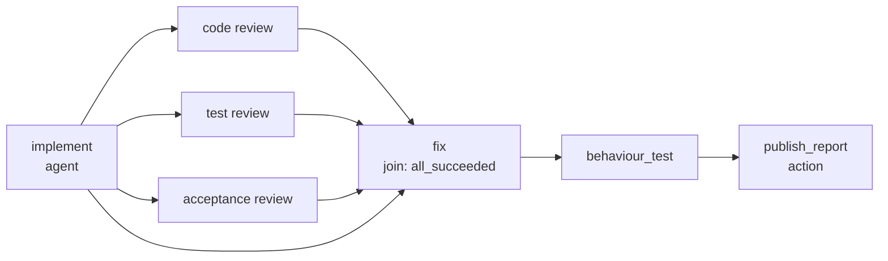

# ADR 0006: Format V3 is the whole authoring language; capabilities stage execution

- Status: DRAFT — proposed for review, not accepted, not implemented
- Date: 2026-08-14
- Depends on: [ADR 0002](0002-exact-yaml-graph.md), [ADR 0001](0001-durable-runtime.md)
- Requirement authority: [Issue #1](https://github.com/FlexOr2/atelier-2/issues/1)
- Feeds: [#6](https://github.com/FlexOr2/atelier-2/issues/6) (catalog),
  [#7](https://github.com/FlexOr2/atelier-2/issues/7) (Dirigent)
- Names, never decides, the dependencies owned elsewhere:
  [#22](https://github.com/FlexOr2/atelier-2/issues/22) (catalog identity),
  [#24](https://github.com/FlexOr2/atelier-2/issues/24) (platform adapter),
  [#25](https://github.com/FlexOr2/atelier-2/issues/25) (bounded iteration),
  [#26](https://github.com/FlexOr2/atelier-2/issues/26) (budget),
  [#9](https://github.com/FlexOr2/atelier-2/issues/9) (interactive attach),
  #1 story 5 (context resolver)

Two version numbers meet in this record and must not be confused. **V1** is the
product release Issue #1 decides. **Format version 3** is the workflow document
contract this record proposes, the third after the V1 and V2 of
[ADR 0002](0002-exact-yaml-graph.md). V3 is the document surface that expresses
the product's V1 contract.

## Context

An Agent node today carries a `role` and a one-line `job` string, and format V1's
Agent carries an exact expected output. Nothing else about the work is
expressible: no authored instruction, no statement of which earlier result a node
may read, no typed result, no statement of where a finished result lands, no
skills, no policy, no budget. The single Action node performs one hardcoded
effect. Execution is one successor chain.

That vocabulary cannot express any chain a real story needs. #6 asks for a
catalog of named, versioned chains and names the missing substrate exactly: node
prompts, typed context edges, and output/handoff adapters, present in no schema
and no decision record. #7's Dirigent authors revisions from a chat and can only
author what the format can express. Until this vocabulary exists, every catalog
entry is a renamed toy chain.

Issue #1 already decided the semantics on 2026-08-11/12: the versioned workflow
document decides per node what context is relevant and how data flows; the core
adds no ambient project context; the canonical node call distinguishes required
context, available context, explicit upstream inputs, named typed hashed outputs,
and provider-neutral instructions, capabilities and policy; declared dependencies
form an acyclic graph whose ready set is executed in parallel within the
configured limits; a fan-in node names its join condition and every input; a
successor sees only explicitly mapped outputs; a summary does not replace its
sources; rights, tools, skills, provider, model, budget, input, output, retry,
cancel and successor transition belong to the node contract rather than to
hardcoded ceremony; an output that violates its declared schema is a terminal node
failure, never a silent artifact; irreversible external mutation runs exclusively
through declared Action nodes with intent, readback and receipt. #9 Rev. 4 decided
that execution mode is a capability declaration: headless is mandatory for every
provider, interactive is declared, and a node demanding interactive on a
non-declaring configuration fails at validation, never silently.

This record does not re-decide any of that. It decides the **document surface**
that expresses it, and it decides that surface **completely and at once**.

## Decision

### One author language, staged execution

Format version `3` is a new closed contract parsed by the existing safe-YAML
adapter, not an edit of V2. Every guarantee of ADR 0002 survives unchanged: exact
UTF-8 bytes identify the revision by SHA-256, the strict frozen model is validated
before any run or revision is written, unknown fields and node kinds, duplicate
keys, missing references, cycles, unreachable nodes, multiple documents, BOMs,
anchors, aliases, merges and explicit tags are refused, and declared edges own
execution order while list order means nothing.

V3 carries the **complete** authoring surface Issue #1 decided, including the
parts no runtime executes yet. What the current runtime can execute is not a
property of the format; it is a **published runtime capability revision** that the
run binds at start. Validation therefore runs in three phases, and only the third
depends on what exists today:

1. **Document validity** — parse time, capability-independent. A valid V3 document
   is valid forever; a growing executor never changes what a stored revision
   means.
2. **Reference binding** — publish preview and run start. Every versioned
   reference in the document must resolve to a published revision in the bound
   registries, or the operation is refused naming the reference.
3. **Executability** — run start. Every capability the document requires must be
   declared by the bound runtime capability revision. A missing one refuses the
   **whole run** as `UNAVAILABLE`, naming the exact node and the exact missing
   capability. Never silently, never partially: a graph executed down to its first
   unsupported node would produce receipts for a shape nobody accepted.

Publishing a revision the current runtime cannot execute is permitted, and the
publish preview marks every such node with the capability it waits for. This is
the point of the record. Revisions are immutable, so staging the *format* instead
of execution would force a new format version and a re-authoring of every catalog
entry each time a capability lands — the churn V3 exists to prevent. Staging
execution costs one loud refusal.

Capability names are part of this contract, because a refusal must name something
stable:

| Capability | Gates |
| --- | --- |
| `dag_scheduling` | more than one dependency edge into or out of a node — fan-out, fan-in, joins, parallel ready sets (#1 story 3) |
| `context_resolution` | `available_context` grants and resolver-materialized `required_context` with access receipts (#1 story 5) |
| `isolated_workspace` | an attempt's isolated hashed workspace, and any output schema derived from it |
| `external_effects` | Action nodes, granted per adapter operation and bounded by the number of effects per run the reconciliation proof covers |
| `deterministic_operations` | Deterministic nodes |
| `subworkflow_execution` | Subworkflow nodes |

`mode: interactive` is deliberately absent from that table, because #9 Rev. 4 gave
it a declarer already: the bound agent-configuration revision. One capability must
have exactly one declarer, so mode is compared against that binding at run start
and refuses with the same loud, node-naming shape.

### The node contract

Every node kind shares one shape. The kind decides what performs the work; the
shared fields decide what it may see, what it must produce, and what bounds it.

```yaml
- id: "<unique node id>"
  type: agent | deterministic | wait | subworkflow | action
  depends_on: ["<node id>"]
  join: all_succeeded | all_terminal
  required_context: []
  available_context: []
  inputs: []
  outputs: []
  budget: {ref: "<budget policy id>", revision: "<policy revision id>"}
  retry: {ref: "<retry policy id>", revision: "<policy revision id>"}
  cancellation: {ref: "<cancellation policy id>", revision: "<policy revision id>"}
```

`depends_on` replaces the `next` chain and is the only control edge. The initial
ready set is every node with no dependency; a node is terminal when it has no
dependents; the run is terminal when the ready set is empty and every node has its
terminal receipt. There is no distinguished terminal node and no `start` key: both
are derived from the edges, so a document cannot declare an order its edges
contradict. The terminal hash keeps covering the ordered event hashes, unchanged.

`join` is required on any node with more than one dependency and is closed at
exactly the two conditions #1 decided: `all_succeeded`, and `all_terminal` — under
which a failed, cancelled or stale branch delivers its terminal receipt as the
input, so it can never vanish as a success. This set is closed because the
requirement authority closed it, not because today's scheduler is small.

`budget`, `retry` and `cancellation` are versioned references to published policy
revisions. The document pins **which** policy applies; the policy owner defines
what it means (budget units are #26). The invariants #1 fixed are not policy
options: a run cancel drives every running node to exactly one terminal cancel
receipt, already-started siblings drain, exhausted budget is a terminal failure
receipt rather than silent hanging, and a restart reconstructs the same ready set
without re-running a confirmed node.

The five kinds:

- `agent` — one provider-executed attempt. Detailed below.
- `deterministic` — a declared operation the core computes from its inputs with no
  provider and no external effect; a retry with identical inputs recomputes an
  identical output hash. Binds `operation: {ref, revision}`.
- `wait` — a durable stop for an attributed operator answer or approval. Binds an
  answer schema reference and produces it as a typed output. This is #1's
  asynchronous approval gate, not a conversation.
- `subworkflow` — binds a published workflow revision with mapped inputs and
  outputs. The toy adder of ADR 0002 is not part of V3.
- `action` — the only node that may mutate anything outside the run. Detailed
  below.

### The Agent node

```yaml
- id: implement
  type: agent
  role: builder
  mode: headless
  instruction: |
    work-specific instruction text
  skills:
    - {ref: "<skill id>", revision: "<skill revision id>"}
  tools:
    - {ref: "<tool id>", revision: "<tool grant revision id>"}
  policy: {ref: "<policy id>", revision: "<policy revision id>"}
  required_context: []
  inputs: []
  outputs: []
```

`instruction` replaces `job` and carries **only work-specific instruction** — what
this node must do in this chain. It is authored text inside the exact document
bytes, so it is inside the revision hash, immutable for a started run, and visible
in the publish preview. It is instruction, never context and never a secret; its
bound is 16 KiB of UTF-8, and an empty or oversized instruction is refused.
Anything reusable — a reviewer's discipline, house output conventions, a role's
standing method — is a **versioned `skills` reference**, never copied inline.
Context belongs in `required_context`, `available_context` and `inputs` so it is
revision-bound, hashed and provenance-carrying; an instruction that pastes
requirement text instead is legal YAML and a review finding, not a format error.

The immutable references an Agent node binds split by ownership:

- **What the work is** is authored and pinned in the document: instruction bytes,
  `skills`, the `tools` grant, the `policy` (capability and permission) revision,
  and the budget, retry and cancellation policy revisions. These change the meaning
  of the work, so they belong to the revision that is judged and published.
- **Who performs it** is deployment configuration bound at run start: `role` keeps
  its V2 meaning exactly — the portable document names the logical role, and the
  run-start command binds every graph role to exactly one immutable
  agent-configuration revision (provider, model, auth profile) and no others. The
  document must not pin that revision, because the same published chain has to run
  on a different provider matrix without becoming a different document. Two nodes
  needing two different configurations name two different roles.

The node call therefore carries an immutable reference for every axis, and the run
snapshot records each resolved revision id (see "What the run binds").

`mode` is `headless` or `interactive` and is **always explicit**; there is no
default. Per #9 Rev. 4 the node declares the requirement and the bound agent
configuration declares the capability. An `interactive` node either declares no
outputs, or declares every output `confirmed_by: operator`; an interactive output
mapped downstream without that confirmation is refused.

### Context edges

Three reference kinds, one binding model. All are immutable, hashed and
revision-bound; per #1 they differ in provenance and in when they are fetched.

```yaml
required_context:
  - name: story
    source: {ref: requirement, revision: "<requirement revision id>", selector: story_acceptance}
available_context:
  - name: decision_records
    source: {ref: decision_record_index, revision: "<index revision id>"}
inputs:
  - name: candidate
    from: {node: implement, output: candidate}
```

`required_context` names resolver-materialized sources, fully materialized and
hashed before START; a source that cannot be materialized means the node does not
START.

`available_context` names #1's on-demand grant: a revision-bound source the agent
reads only if it needs to, and every fetch produces a `ContextAccessReceipt` with
source, revision, request and result hash. It is **in the format**, and it is
gated by the `context_resolution` capability. That is the whole difference from a
grant nobody enforces: an unenforceable grant is never published as enforceable,
it is refused at run start naming the missing capability, so #7's Dirigent authors
one stable shape today and the resolver story starts executing it without a new
format version.

`inputs` name an exact output of an exact earlier node. The referenced node must
lie in the transitive closure of `depends_on`, and the referenced output must be
declared by it; a data edge without the control edge that orders it is refused at
parse, so data flow can never imply an ordering the graph does not state. Inputs
may skip intermediate nodes, which is what makes a fix node expressible: it reads
the original candidate and each review's findings, and the reviews are not merged
into a shared chat.

A source is a versioned reference; a `required_context` source additionally names
the exact `selector` that must be materialized, while an `available_context` source
grants the whole revision-bound source and lets the agent choose its reads. The set
of source kinds is not closed by this format: a source names a published
source-kind revision in the resolver's registry, so the resolver story adds kinds
without a format version. An unresolvable reference is refused at binding, naming
it.

There is no ambient context. A node sees its instruction, its skills, its required
context, its granted available context, its inputs and its declared capabilities.
Conversation history and agent working memory are never passed to a successor.

### Outputs bind versioned schemas

```yaml
outputs:
  - name: findings
    schema: {ref: review_verdict, revision: "<schema revision id>"}
```

An output is named, typed by a **versioned schema reference**, and hashed. The
format closes no list of kinds: `text`, a review verdict, and #1's workspace
candidate are the first published schema revisions, not format vocabulary, so a
chain needing a new artifact shape publishes a schema instead of migrating every
stored document. Output bytes that do not satisfy the bound schema revision are a
terminal node failure, never a silent artifact. A schema derived from an attempt's
isolated workspace requires the `isolated_workspace` capability, so a node
declaring a candidate refuses the run where that isolation is not provable —
fail-closed exactly like #1's auth modes.

### Actions bind versioned adapter operations

Every landing of a result outside the run's own hashed outputs is an effect, so
every handoff is an Action node — never free code, never a side channel on an
Agent node.

```yaml
- id: publish_report
  type: action
  depends_on: [behaviour_test]
  operation: {ref: "<platform operation id>", revision: "<operation revision id>"}
  arguments:
    - name: body
      from: {node: behaviour_test, output: report}
  logical_key: [run, publish_report]
```

An Action binds one **versioned adapter-operation contract**. That contract owns
the operation's arguments, its addressing, its authorization, its readback and its
receipt shape; the core knows only that a reference must resolve, that the
operation declares an effect class, and that the effect runs under #1's intent,
readback and receipt discipline, idempotent under its `logical_key`, so a restart
cannot duplicate it. No platform identifier appears in this record or in the core:
which operations GitHub offers, how it is addressed and authorized, and what its
readback proves are #24's, so a GitLab adapter is a new operation registry rather
than a workflow-format migration.

An unresolvable operation reference is refused at binding, naming it. A resolvable
operation the deployment has not granted refuses the run at start, fail-closed and
named; it is never silently skipped. The format sets **no limit** on the number of
Action nodes; how many effects per run the runtime executes is the
`external_effects` capability, whose current bound is whatever the reconciliation
proof covers.

### What the run binds

A run start binds one published **run configuration revision** and records it in
the run snapshot, ordered by exact UTF-8 bytes and hashed with the run. It names,
as published immutable revision ids: the role matrix (role → agent-configuration
revision, and with it provider, model and auth profile), every skill and tool
revision the document pinned, the policy, budget, retry and cancellation
revisions, the schema registry revision, the adapter operation registry revision,
the context source registry revision, and the runtime capability revision.

Nothing a node call depends on may come from diffuse server-start state. Per #1
only small bootstrap, secret and hosting values belong to the server start;
everything that varies by project, provider, workflow, environment or runtime is a
published revision. A running run is never silently rebound, and a retry may not
change the matrix. Credentials are capabilities, never workflow fields, never
context, and never durable state.

### The conductor is a client, and every surface shows the same graph

The Dirigent of #7 is an ordinary author and API client. It has no node kind, no
privileged bypass, no hidden system node, no provider-dependent extra ceremony,
and no command the operator does not also have. It publishes and starts through
the same attributed commands, under the same publish gate (#6 Rev. 2: name the
nearest existing catalog entry and why it does not suffice), and the runtime
executes only the visible published revision.

Because it is a client, the operator must be able to see exactly what it authored.
The publish preview, the typed API projection and the cockpit are three renderings
of one revision's bytes and must project it **losslessly**: every node and its
kind, every control and data edge, required and available context and upstream
inputs, the role and the provider and model bound to it, skills, tools and
capabilities, budget, retry and cancellation, approval points, and every external
effect. A surface may collapse detail behind a default, and it may say that it
cannot render a field, but it may never omit one silently or make one
uneditable-by-hiding. Equal projection is a testable property, not a style
guideline: the same revision rendered through the three surfaces yields the same
graph.

### Refusals

Refused at parse, capability-independent: unknown field or node kind; duplicate
node id, input name or output name; a cycle; an unreachable node; a dependency on
an unknown node; a data edge whose node is not in the dependency closure; a data
edge to an undeclared output; a missing `join` on a node with several
dependencies; an empty or oversized instruction; an absent `mode`; an interactive
node whose output is mapped downstream without operator confirmation; a malformed
or unpinned versioned reference.

Refused at binding: any versioned reference — skill, tool, policy, budget, retry,
cancellation, schema, adapter operation, context source, subworkflow — that does
not resolve to a published revision.

Refused at run start: an ungranted adapter operation; a role without exactly one
bound agent-configuration revision; an `interactive` node whose bound
agent-configuration revision does not declare interactive; and any capability the
document requires that the bound runtime capability revision does not declare,
naming node and capability.

A V3 document carrying `job`, `output`, `next`, `start`, `answer_type` or
`operands` is refused with the retired key and its replacement named, so an author
who copied a V2 example learns what replaced it instead of reading a generic
closed-schema error.

### What binds a node call

The revision hash already covers the instruction bytes and every pinned reference.
The agent execution request must additionally bind, as `agent-execution-request/v3`:
the mode, the ordered materialized required-context hashes, the ordered input
output-hashes, the resolved agent-configuration, skill, tool and policy revision
ids, and the declared output names and schema revisions. A changed context is then
a different logical operation rather than a silent re-run of the same one, and a
retry with identical inputs stays the same operation. The terminal node receipt
correspondingly binds one ordered tuple of `(name, schema revision, hash)` plus the
access receipts actually used, instead of one anonymous output blob
(`agent-receipt/v3`). That receipt change is the largest implementation cost of
this record and is named, not hidden.

## Worked example: a self-build chain for this repository

One real chain for one story of this repository, written to double as the first
seed of the #6 catalog. Instructions are illustrative authored text and every
`revision` value is a placeholder for a published revision id; the shape is the
decision.



```yaml
format_version: 3
nodes:
  - id: implement
    type: agent
    role: builder
    mode: headless
    instruction: |
      Implement every literal acceptance sentence of the bound story inside your
      workspace. Change nothing outside it. Return the candidate you produced and
      a summary naming which sentence each change serves.
    skills:
      - {ref: workspace_discipline, revision: "<skill revision id>"}
    policy: {ref: build_policy, revision: "<policy revision id>"}
    budget: {ref: build_budget, revision: "<budget revision id>"}
    required_context:
      - name: story
        source: {ref: requirement, revision: "<requirement revision id>", selector: story_acceptance}
    available_context:
      - name: decision_records
        source: {ref: decision_record_index, revision: "<index revision id>"}
    outputs:
      - name: candidate
        schema: {ref: workspace_candidate, revision: "<schema revision id>"}
      - name: summary
        schema: {ref: text, revision: "<schema revision id>"}

  - id: code_review
    type: agent
    role: code_reviewer
    mode: headless
    instruction: |
      Judge the candidate against the acceptance sentences. Read only what you
      were given. Return pass only if every sentence has a proof; otherwise return
      fail and name each defect with its file and the sentence it violates.
    skills:
      - {ref: review_discipline, revision: "<skill revision id>"}
    policy: {ref: read_only_policy, revision: "<policy revision id>"}
    depends_on: [implement]
    required_context:
      - name: story
        source: {ref: requirement, revision: "<requirement revision id>", selector: story_acceptance}
    inputs:
      - name: candidate
        from: {node: implement, output: candidate}
      - name: summary
        from: {node: implement, output: summary}
    outputs:
      - name: findings
        schema: {ref: review_verdict, revision: "<schema revision id>"}

  - id: test_review
    type: agent
    role: test_reviewer
    mode: headless
    instruction: |
      Judge whether each acceptance sentence is pinned by a behavioral test at the
      cheapest honest layer, and name every sentence no test proves.
    skills:
      - {ref: review_discipline, revision: "<skill revision id>"}
    policy: {ref: read_only_policy, revision: "<policy revision id>"}
    depends_on: [implement]
    required_context:
      - name: story
        source: {ref: requirement, revision: "<requirement revision id>", selector: story_acceptance}
    inputs:
      - name: candidate
        from: {node: implement, output: candidate}
    outputs:
      - name: findings
        schema: {ref: review_verdict, revision: "<schema revision id>"}

  - id: acceptance_review
    type: agent
    role: acceptance_reviewer
    mode: headless
    instruction: |
      Judge the candidate only against the operator's literal acceptance
      sentences. Do not reopen a decision the story already made.
    skills:
      - {ref: review_discipline, revision: "<skill revision id>"}
    policy: {ref: read_only_policy, revision: "<policy revision id>"}
    depends_on: [implement]
    required_context:
      - name: story
        source: {ref: requirement, revision: "<requirement revision id>", selector: story_acceptance}
    inputs:
      - name: candidate
        from: {node: implement, output: candidate}
    outputs:
      - name: findings
        schema: {ref: review_verdict, revision: "<schema revision id>"}

  - id: fix
    type: agent
    role: builder
    mode: headless
    instruction: |
      You receive the original candidate and each review's findings. Resolve every
      named defect and return the new candidate. If no finding names a defect,
      return the candidate unchanged.
    skills:
      - {ref: workspace_discipline, revision: "<skill revision id>"}
    policy: {ref: build_policy, revision: "<policy revision id>"}
    budget: {ref: build_budget, revision: "<budget revision id>"}
    depends_on: [implement, code_review, test_review, acceptance_review]
    join: all_succeeded
    required_context:
      - name: story
        source: {ref: requirement, revision: "<requirement revision id>", selector: story_acceptance}
    inputs:
      - name: candidate
        from: {node: implement, output: candidate}
      - name: code_findings
        from: {node: code_review, output: findings}
      - name: test_findings
        from: {node: test_review, output: findings}
      - name: acceptance_findings
        from: {node: acceptance_review, output: findings}
    outputs:
      - name: candidate
        schema: {ref: workspace_candidate, revision: "<schema revision id>"}

  - id: behaviour_test
    type: agent
    role: tester
    mode: headless
    instruction: |
      Run the repository gate against the candidate you were given and report the
      exact commands and their exact counts.
    policy: {ref: read_only_policy, revision: "<policy revision id>"}
    depends_on: [fix]
    inputs:
      - name: candidate
        from: {node: fix, output: candidate}
    outputs:
      - name: report
        schema: {ref: text, revision: "<schema revision id>"}

  - id: publish_report
    type: action
    depends_on: [behaviour_test]
    operation: {ref: requirement_comment, revision: "<operation revision id>"}
    arguments:
      - name: body
        from: {node: behaviour_test, output: report}
    logical_key: [run, publish_report]
```

Four things this example makes visible.

The fan-out is declared, not implied: three review nodes depend on `implement`
alone, so they are one ready set, and `fix` names `join: all_succeeded` over four
dependencies. The scheduler that runs them is #1 story 3; the document that
describes them is this record, and it does not change when that scheduler lands.

`fix` reads the *original* candidate and three separately hashed findings. The
reviews are never merged into a shared chat, and a summary never replaces its
sources.

The chain unrolls its loop exactly once and says so by having one `fix` stage. The
bounded repeat-until-green construct is #25's; because #25 materializes each round
as a further unrolled stage over these same acyclic edges, it needs no new author
surface, and a catalog entry that declares its unroll depth is honest rather than
warty.

`requirement_comment` is a placeholder operation reference. Which operations exist,
how a comment is addressed and authorized, and what its readback proves belong to
#24. Nothing in this record names a platform.

Per #6 Rev. 2, publishing this or any successor revision into the catalog carries
the publish gate: the authoring agent names the nearest existing catalog entry and
why it does not suffice, and the operator sees that justification in the publish
preview.

## What the current runtime can execute

Nothing here, and the record says so rather than implying otherwise. Today's
parser accepts format versions 1 and 2 and refuses `format_version: 3` outright;
no runtime capability revision exists, so no capability above is declared. The
first story that implements V3 declares the subset it proves — plausibly document
validity plus a single-path execution without `dag_scheduling`,
`context_resolution` or `isolated_workspace` — and every later capability is a
declaration change, not a format change. That is the whole staging claim, and it is
falsifiable: if a later capability forces a format version anyway, this record was
wrong.

## Decisions taken on the previously open questions

Each of these changed the surface, so each is decided here rather than left as a
menu. Where a decision genuinely belongs to another owner, the format side is
decided and the dependency is named.

- **`available_context`** — **in the format**, gated by `context_resolution`. One
  format version per capability would re-author the whole catalog each time a
  capability lands; one refusal per unexecutable node costs nothing. Enforcement,
  access receipts and source kinds are #1 story 5.
- **Inline text versus references** — **both, split by reuse**. Inline
  `instruction` carries only work-specific instruction; anything reusable is a
  versioned `skills` reference. A revision's identity stays whole because a
  reference is revision-pinned and recorded in the run snapshot. Naming, lineage
  and storage of those artifacts are #22.
- **`workspace_candidate`** — **not a format concept**. Outputs bind versioned
  schema references; the candidate is the first published schema revision, gated by
  `isolated_workspace`. The format stays implementable and the example stays
  honest.
- **Closed output kinds** — **removed**. A closed enum froze today's executor into
  a durable contract; a schema registry lets a new artifact shape be published
  instead of migrating every stored document.
- **Concrete adapter ids** — **removed from the core**. Actions bind a versioned
  adapter-operation contract; addressing, authorization and readback are #24, so a
  second platform is a new operation registry rather than a format migration.
- **Ordering against #25** — **V3 lands first**. #25 unrolls rounds over these
  same acyclic edges, so it adds runtime and scheduler contract, not author
  surface; a declared unroll depth is honest in the meantime.
- **The terminal node** — **abolished**. Terminal is a run state (empty ready set,
  every node terminal), because a DAG has no single sink. The terminal hash keeps
  covering the ordered event hashes; the named implementation cost is that the
  runtime's terminal handling, bound to the Subworkflow node kind today, must move
  to the run-level condition before V3 executes.
- **`start` and `next`** — **abolished**, replaced by `depends_on`. Derived
  entry and exit sets cannot contradict the edges.
- **`mode` default** — **always explicit**. Mode decides whether a human could
  influence a result and whether downstream outputs count as operator-influenced
  (#9 part 2); nothing that consequential may be true by omission, and the preview
  must state it without knowing a default.
- **One Action per run** — **no format limit**; the `external_effects` capability
  declares what the reconciliation proof covers. Lifting today's bound needs crash
  evidence that two effects in one run each produce at most one effect and exactly
  one receipt — ADR 0001's territory.
- **Receipt shape** — **one terminal node receipt** binding an ordered
  `(name, schema revision, hash)` tuple and the access receipts used. #1 gives every
  node exactly one terminal receipt; one receipt per output would make that count
  ambiguous and each output separately recoverable.
- **Budget, retry and cancellation** — **versioned policy references** in the node
  contract, as #1 requires. Units and normalization are #26; #1's invariants
  (exactly one terminal cancel receipt, sibling drain, budget exhaustion as a
  terminal failure) are not policy options.

## Migration

V1 and V2 documents stay valid and keep their meaning. The parser dispatches on
`format_version` into a separate closed model, so V3 adds a version instead of
widening a frozen one, and no stored revision is ever reparsed under a new
meaning. A started run keeps executing under the version it bound. There is no
runtime document migration and none is needed, which matters because
[ADR 0001](0001-durable-runtime.md) knows no runtime migration path.

## Consequences

- A catalog entry can express a real chain — authored instruction, reusable skills,
  who sees what, parallel work, a deterministic join, bounds, and where a result
  lands. The substrate gap #6 names is closed at the document level.
- A capability landing changes a declaration, not a format version. The cost is a
  second, published, run-bound artifact — the runtime capability revision — and the
  discipline that every refusal names a capability rather than a version.
- Publishable is deliberately wider than executable. An operator can be shown a
  graph the machine will refuse to start, and the preview must say which node waits
  for what; a preview that omits that mark is a defect, not a cosmetic gap.
- The Agent receipt and the agent execution request grow a version to carry named
  typed outputs, bound context and resolved revision ids. That is a durable-contract
  change with crash evidence, not a field addition.
- The runtime's terminal handling and single-successor advance both move: to the
  run-level terminal condition, and to a ready set over `depends_on`.
- The format still expresses no conditional branching and no loop; iteration is
  #25's explicitly unrolled stages. V3 is a declarative dependency graph, not a
  general programming language, and that boundary is deliberate.
- An author who writes V2 habits into a V3 document gets a refusal naming the
  retired key.

## Required proofs before acceptance

This record is a draft; nothing below exists yet.

- A V3 document parses to a closed frozen model, and every parse-time refusal above
  is proven by its own behavioral case, parametrized over the refusal list rather
  than copied per case.
- Executability is proven separately from validity: the same valid document is
  accepted at publish, marked in the preview, and refused at run start naming the
  exact node and missing capability; and it starts unchanged once the capability
  revision declares that capability.
- Every versioned reference kind refuses an unresolvable revision at binding, naming
  the reference.
- The worked example above parses, publishes, and round-trips byte-identically.
- V1 and V2 example documents from the existing suites still parse unchanged.
- The request and receipt hash vectors are literal and pinned; a changed context
  hash produces a different request identity while an identical retry does not.
- One revision rendered through publish preview, API projection and cockpit yields
  the same graph, field for field.

## Out of scope

This record decides a document surface, its bindings and its refusals. It decides
nothing about: the engine or executor implementation; the scheduler, ready set and
parallelism (#1 story 3); catalog identity, naming, lineage and storage (#22); the
bounded iteration construct (#25); any platform adapter's operations, addressing
and authorization (#24); budget units (#26); interactive attach, transcripts and
remote runners (#9 parts 2 and 3); and the privileged context resolver with its
access receipts (#1 story 5).

## Supersedes

None. This record extends [ADR 0002](0002-exact-yaml-graph.md), which remains the
owner of the document, graph, identity and transition contracts for every format
version.
